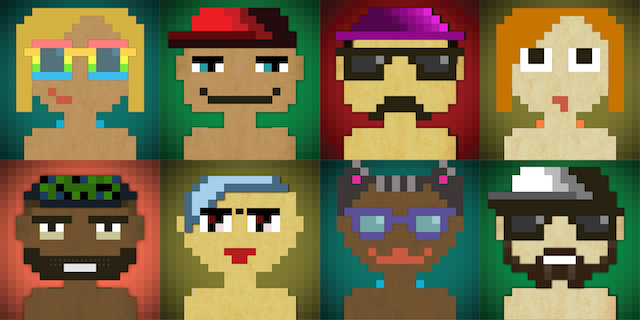

# Pixitar




Pixitar is an avatar generation library written in Ruby. Generate random, male or female avatars.

Inspired by https://github.com/matveyco/8biticon (author of the original image assets). 

## Installation

Add this line to your application's Gemfile:

```ruby
gem 'pixitar'
```

And then execute:

    $ bundle install

Or install it yourself as:

    $ gem install pixitar

## Usage

```
require "pixitar"

avatar = Pixitar::Avatar.new
avatar.generate_avatar                         " Generates a random with either male or female face and saves it to avatar.png
avatar.generate_avatar(:male, "avatar.png")    " Generates a random avatar with male face and saves it to avatar.png
avatar.male_avatar                             " Generates a random avatar with male face and saves it to avatar.png
avatar.female_avatar                           " Generates a random avatar with female face and saves it to avatar.png
```

## Development

Run `rake test` to run the tests.

## Contributing

Bug reports and pull requests are welcome on GitHub at https://github.com/ptcodes/pixitar.

1. Fork it (<https://github.com/ptcodes/pixitar.cr/fork>)
2. Create your feature branch (`git checkout -b my-new-feature`)
3. Commit your changes (`git commit -am 'Add some feature'`)
4. Push to the branch (`git push origin my-new-feature`)
5. Create a new Pull Request

## License

The gem is available as open source under the terms of the [MIT License](https://opensource.org/licenses/MIT).
